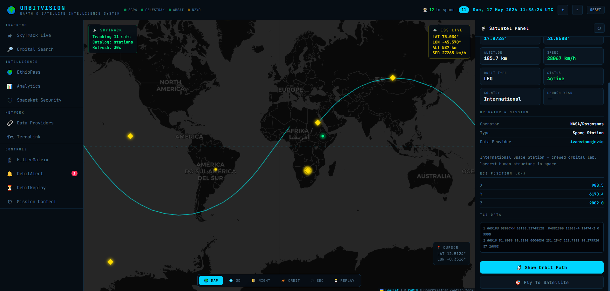

# 🛰️ OrbitVision-System

<div align="center">

### Real-Time Satellite Tracking & Orbital Monitoring Platform



<br><br>


</div>

---

# 🌌 About

OrbitVision-System is a modern satellite tracking and orbital monitoring platform built with Python and Flask.

The system provides:
- 🛰️ Real-time satellite tracking
- 🌍 Interactive globe visualization
- 📡 Telemetry monitoring
- 📈 Orbital analytics
- 🧭 Orbit prediction systems
- 🌐 Live satellite mapping

Designed for aerospace enthusiasts, researchers, and developers interested in orbital systems and space technology.

---

# ✨ Features

## 🛰️ Satellite Tracking
- Live satellite position tracking
- Real-time orbit updates
- Space object monitoring
- Orbit trajectory visualization

## 🌍 Interactive Visualization
- 3D globe rendering
- Interactive satellite maps
- Real-time orbital display
- Dynamic tracking interface

## 📡 Telemetry Monitoring
- Live telemetry data
- Satellite analytics
- Monitoring dashboard
- Tracking statistics

## ⚡ Web Platform
- Flask backend
- Responsive UI
- Interactive frontend
- API-based architecture

---

# 🛠️ Tech Stack

```txt
Python
Flask
JavaScript
HTML5
CSS3
OpenLayers / Globe Visualization
Satellite APIs
Orbital Mechanics Libraries
```

---

# 📂 Project Structure

```bash
OrbitVision-System/
│
├── api/
│   ├── __init__.py
│   ├── analytics.py
│   ├── celestrak.py
│   ├── ethiopia.py
│   ├── providers.py
│   └── skytrack.py
│
├── static/
│   ├── css/
│   │   └── style.css
│   │
│   └── js/
│       ├── app.js
│       ├── globe.js
│       └── map.js
│
├── templates/
│   └── index.html
│
├── Capture.PNG
├── README.md
├── app.py
├── requirements.txt
├── runtime.txt
└── vercel.json
```

---

# ⚡ Installation

## Clone Repository

```bash
git clone https://github.com/estelaet/OrbitVision-System.git
cd OrbitVision-System
```

## Install Dependencies

```bash
pip install -r requirements.txt
```

## Run Application

```bash
python app.py
```

---

# 🌐 Deployment

This project supports deployment using:

- Vercel
- Flask
- Python Runtime

Configuration files included:
- `vercel.json`
- `runtime.txt`

---

# 🖥️ Platform Preview

<div align="center">


</div>

---

# 🎯 Applications

- 🛰️ Satellite orbit tracking
- 🌍 Orbital visualization systems
- 📡 Telemetry monitoring
- 🚀 Aerospace research
- 🧭 Space object tracking
- 📈 Orbital analytics

---

# 🧠 Future Roadmap

- [ ] Live ISS tracking
- [ ] 3D Earth rendering improvements
- [ ] Advanced telemetry analytics
- [ ] Multi-satellite monitoring
- [ ] Real-time space weather data
- [ ] Space debris tracking
- [ ] AI-powered orbit prediction
- [ ] Mobile support

---

# 🤝 Contributing

Contributions are welcome.

```bash
# Fork repository
# Create feature branch
git checkout -b feature-name

# Commit changes
git commit -m "Added new feature"

# Push changes
git push origin feature-name
```

Then open a Pull Request.

---

# 📜 License

Licensed under the **MIT License**.

---

# 🌠 Vision

OrbitVision-System aims to become a modern open-source satellite intelligence and orbital tracking platform capable of real-time monitoring, visualization, and analytics for global space systems.

---

<div align="center">

## 🚀 Tracking Space in Real Time

Made with ❤️ by **Estelaet**

### 🔗 Repository
https://github.com/estelaet/OrbitVision-System

</div>
